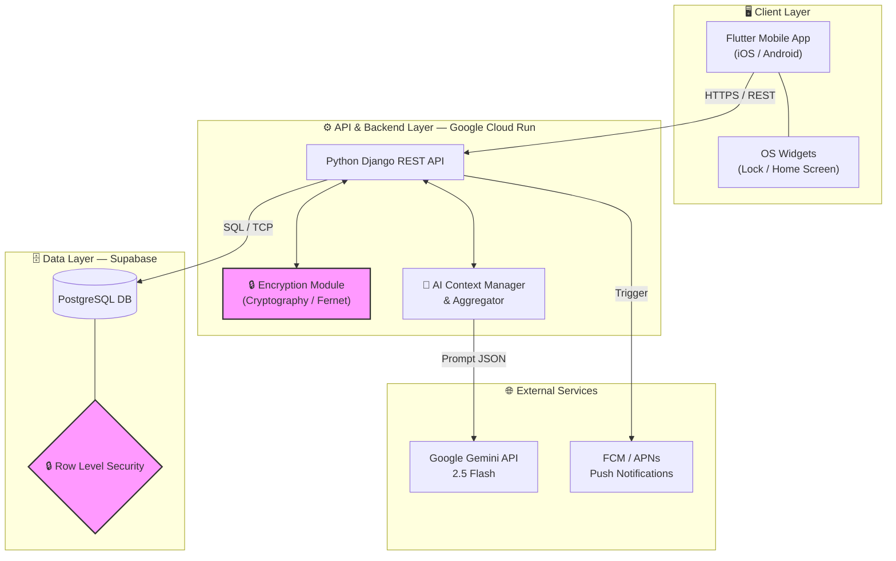
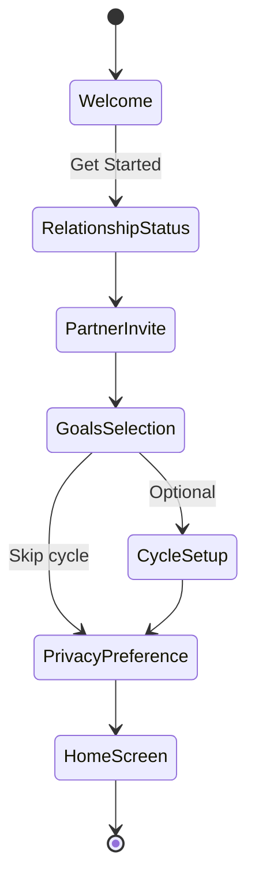
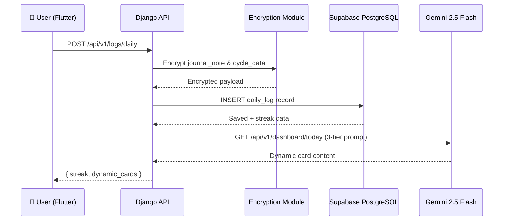
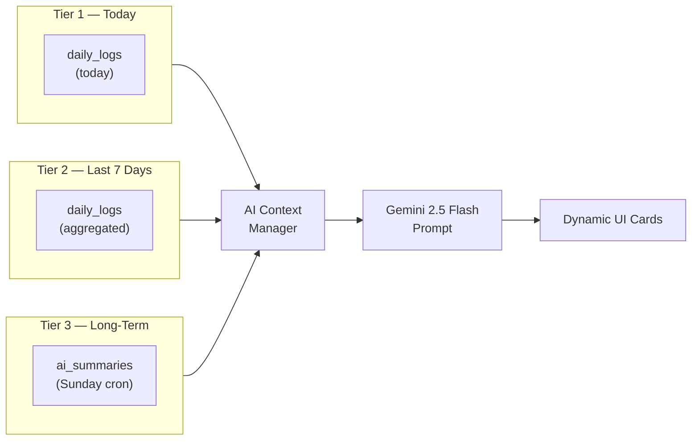
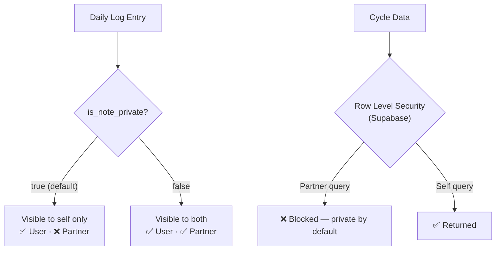

# Zuno – Architecture Diagrams

## 1. System Topology

---

## 2. Onboarding State Machine

---

## 3. Daily Logging Flow

---

## 4. 3-Tier AI Memory Architecture

---

## 5. Privacy Data Flow

