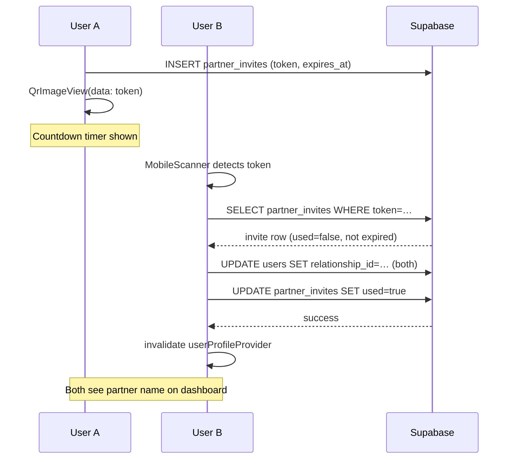

# Pair with Partner — Walkthrough

## What Was Built

QR-code based one-time partner pairing flow accessible via the **"You" tab** in the bottom nav bar.

## Files Changed

| File | Change |
|---|---|
| [pubspec.yaml](file:///c:/github/personal/zuno/zuno/pubspec.yaml) | Added `qr_flutter ^4.1.0` and `mobile_scanner ^5.2.3` |
| [lib/features/pairing/pair_provider.dart](file:///c:/github/personal/zuno/zuno/lib/features/pairing/pair_provider.dart) | **[NEW]** Token generation + claiming logic |
| [lib/features/pairing/you_screen.dart](file:///c:/github/personal/zuno/zuno/lib/features/pairing/you_screen.dart) | **[NEW]** "You" tab — profile hero + pair/coupled cards |
| [lib/features/pairing/pair_invite_screen.dart](file:///c:/github/personal/zuno/zuno/lib/features/pairing/pair_invite_screen.dart) | **[NEW]** QR code display with countdown timer |
| [lib/features/pairing/pair_scan_screen.dart](file:///c:/github/personal/zuno/zuno/lib/features/pairing/pair_scan_screen.dart) | **[NEW]** Camera scanner with styled overlay |
| [lib/router.dart](file:///c:/github/personal/zuno/zuno/lib/router.dart) | Added `/you`, `/pair/invite`, `/pair/scan` routes |
| [lib/features/dashboard/dashboard_screen.dart](file:///c:/github/personal/zuno/zuno/lib/features/dashboard/dashboard_screen.dart) | "You"/"Us" nav tab is now tappable → goes to `/you` |

## Required: Supabase Migration

> [!IMPORTANT]
> Run [supabase_partner_invites_migration.sql](file:///c:/github/personal/zuno/zuno/docs/supabase_partner_invites_migration.sql) in your **Supabase SQL Editor** before testing.

## Flow Overview

## Manual Test Steps

1. `flutter run` in `c:\github\personal\zuno\zuno`
2. Log in as **User A** → tap **"You"** in bottom nav
3. Tap **"Pair with Partner"** — QR code + 10:00 countdown appears
4. On a second device as **User B** → tap **"Scan Partner's Code"**
5. Point camera at User A's QR — success snackbar appears
6. Both devices return to dashboard showing partner name
7. ✅ Try scanning the same code again → "Invite already used or expired"
8. ✅ Wait 10 min (or let timer run out on invite screen) → auto-refreshes to new code
